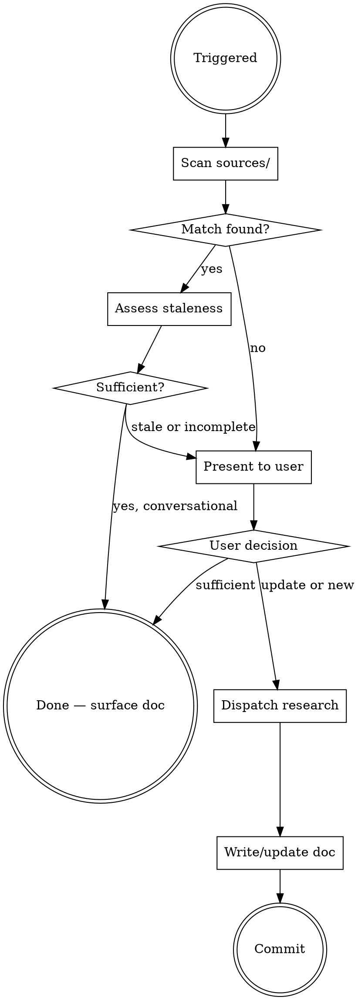

# Research

Check existing research before doing new work. Update rather than duplicate. Enforce consistent format with dating and sourcing.

## Memento root

```bash
MEMENTO_ROOT="$(../_shared/scripts/memento-root)"
```

See `../_shared/references/memento-root.md` for the full resolution contract.
All `sources/` paths are relative to `MEMENTO_ROOT`.

## Process



## Phase 1: Recall

Before any new work:

1. Glob `sources/**/*.md` for all research docs
2. Read frontmatter from each (just the YAML block — don't read full content yet)
3. Match by keyword overlap against filename, `topic`, and `tags`
4. If match found, assess staleness: compare `date` vs today using `staleness` hint
   - `high`: stale after days
   - `medium`: stale after weeks
   - `low`: stale after months
5. Tell the user what exists, when it was written, staleness assessment

If the user is asking conversationally ("what do we know about X?"), read and surface the matching doc. Stop here.

## Phase 2: Decision

Present recommendation:
- **Sufficient** — exists, current. Surface it, stop.
- **Update** — exists, stale or incomplete. Proceed to Phase 3 in update mode.
- **New** — nothing relevant. Proceed to Phase 3 in create mode.

User can override ("just update it", "start fresh", "that's fine").

## Phase 3: Research

### Dispatch via legate (preferred)

If the legate plugin is available (check if `legate:dispatch` skill exists in the system
reminder), **always dispatch research to a legate session** rather than doing it inline.
This frees the main conversation for other work.

Dispatch with a research brief:

```
/dispatch "research: <topic>"
```

The brief should include:
- The topic and specific questions to answer
- Whether this is a new doc or update to an existing one
- If updating, the path to the existing doc and what's stale
- The required output format (see template below)
- The destination path: `sources/YYYY-MM-DD-HHmm-topic-slug.md`

After dispatching, tell the user research is running in a legate session and they can
check on it with `/debrief` or `/fin` the session when ready.

### Fallback: inline research

If legate is not available, do the research inline:

1. Spin up parallel research agents via the Agent tool
2. Write or update the doc in `sources/` with enforced format

### Output format

**Filename:** `YYYY-MM-DD-HHmm-topic-slug.md` (24h time avoids collisions when a topic is revisited the same day)

**Required frontmatter:**
```yaml
---
date: YYYY-MM-DD
topic: Human-readable topic description
tags: [keyword1, keyword2]
sources:
  - url: https://example.com
    accessed: YYYY-MM-DD
  - description: "Non-URL source description"
    accessed: YYYY-MM-DD
staleness: high|medium|low
---
```

**Body:** Research content, then a human-readable Sources section at the bottom.

**On update:** Bump `date`. Revise content. Append new sources. Preserve old sources with original access dates.

3. Commit the new/updated doc.

## Backfill

If a matching research doc exists but lacks frontmatter (predates this skill), backfill the frontmatter as part of the update before proceeding.

## Format Rules

- Every research doc gets YAML frontmatter — no exceptions
- Every source gets recorded with access date
- Filename always date-and-time-prefixed: `YYYY-MM-DD-HHmm-topic-slug.md`
- Sources section rendered at bottom of doc (human-readable, not just frontmatter)
- `staleness` field is required — forces the researcher to think about shelf life
