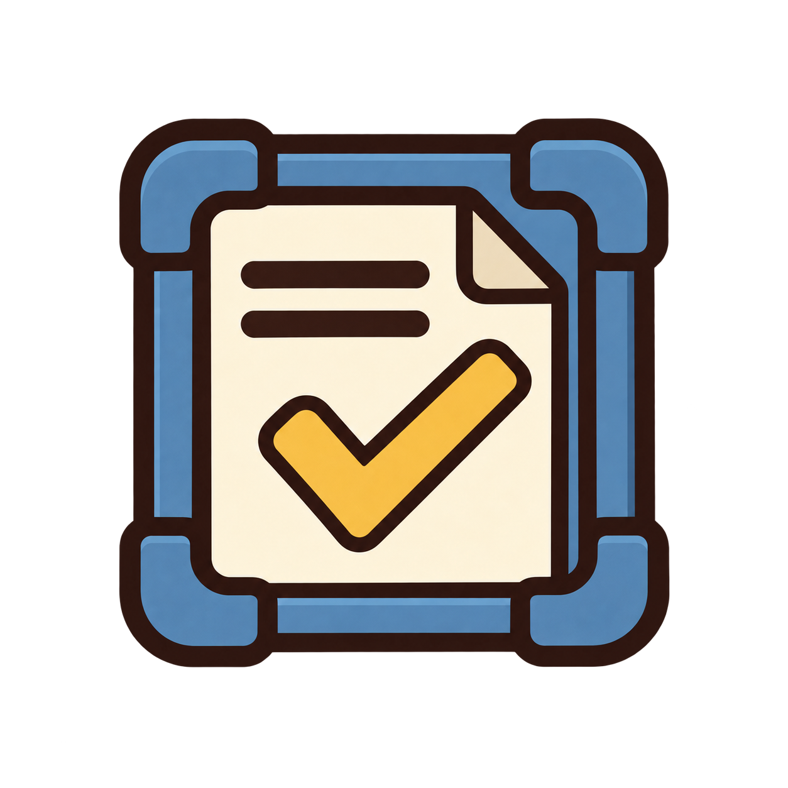

#  Steward — stay aligned, build what matters

Steward helps agents keep up with what you want as the work evolves, simplify
completed changes, and check that the result solves the problem with a
proportionate solution.

- [`align`](skills/align/SKILL.md) helps with discoveries, feedback, and changes
  of direction during work.
- [`simplify`](skills/simplify/SKILL.md) makes worthwhile local edits so completed
  work fits repository patterns and costs less to maintain, preserving behavior.
- [`check`](skills/check/SKILL.md) examines the actual result for missed intent
  and unjustified scope or complexity, without changing it.

All three work from the current request, conversation, and codebase. None needs
a prior Steward document, a fixed sequence of steps, or a special runtime.

## Use it

After [installing Steward](../../README.md#installation), ask for the help you
need:

| Situation | Example request |
| --- | --- |
| A discovery changes the direction | “Use Steward Align. This approach is turning into a background service; are we still solving the problem I asked for?” |
| Feedback changes what matters | “Use Steward Align with my latest feedback and work out the next useful step.” |
| Construction is complete | “Use Steward Simplify on this change. Make it fit the repo and easier to maintain while preserving behavior.” |
| Work looks complete | “Use Steward Check on these changes. Does this solve my problem, and have we overbuilt it?” |
| You suspect drift partway through | “Use Steward Check on the current work before we add anything else.” |

Align can also help at the start when the user's intent needs clarification.
Simplify is optional after construction. Check can be used independently,
including on uncommitted work. When you use both Simplify and a final Check,
Check evaluates the resulting changed state.

## Staying aligned

The agent keeps its understanding of your purpose and priorities current.
Your choices matter more than its initial plan. Discoveries can invalidate an
assumption without changing what you want.

When a discovery affects only the implementation, the agent adapts. When it
creates a meaningful choice about the result, scope, or cost, Align explains the
consequence, recommends a direction, and asks for the decision that needs your
judgment. It uses choices you have already made or delegated and keeps
unaffected authorized work moving.

There is no scheduled check-in cadence or required note to maintain. The
conversation normally carries the context; an existing working note can help
a long task or handoff. Requests only for advice remain advisory.

## Simplifying completed work

Simplify inspects the repository broadly enough to understand its patterns,
then edits the current change and directly related code or documentation
narrowly. It can reuse an established helper, remove needless indirection, or
make control flow clearer when doing so reduces the cost of maintaining the
work. A request to simplify authorizes those worthwhile local edits; a request
only for suggestions stays advisory.

Existing behavior, error handling, performance characteristics, and
permissions must survive the edits. Simplify does not standardize the whole
repository, create abstractions for appearance, or keep finding more cleanup
to do. It verifies the affected behavior and stops after a bounded pass.
Finding nothing worth changing is a valid result.

## Checking the result and its complexity

Check asks whether the work accomplishes the current goal and whether its
solution is justified by that need. It explains what the evidence establishes,
what remains uncertain, and what should change.

A feature can work while carrying unnecessary capabilities, abstractions,
dependencies, configuration, or operational machinery. An excess finding must
identify the addition, its cost, and why the present need does not justify it.
Useful tests, ordinary error handling, existing architectural conventions, or
a large diff are not evidence of overbuilding by themselves.

Check inspects the work without changing it. Its output is a reasoned conclusion
and useful next steps, with no mandatory verdict labels or scoring scheme.

See the [CSV-download example](examples/csv-download.md) for alignment during a
task, a local simplification, and a review that separates useful functionality
from unnecessary additions.

## Current scope

Steward has three skills: `align`, `simplify`, and `check`. Legacy contract
formats remain unsupported, with no import, migration, or compatibility path.
Start from the current goal and relevant user choices in ordinary language.

## Validation

The skill files linked above are the canonical instructions.
[`evals/evals.json`](evals/evals.json) describes behavioral cases for evolving
intent, appropriate user involvement, local simplification, evidence, and
proportionality. These are test scenarios, not a claim of recorded cross-model
results. Repository checks validate skill and distribution structure;
behavioral exercises check judgment.
